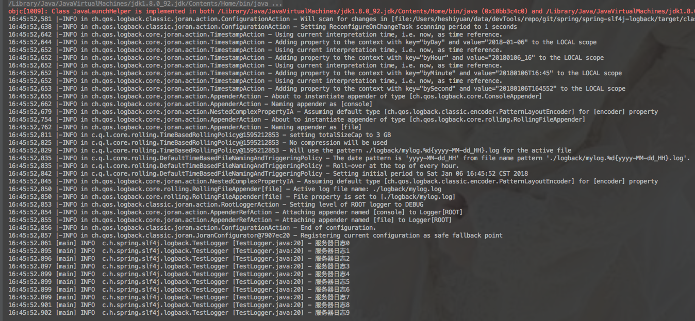
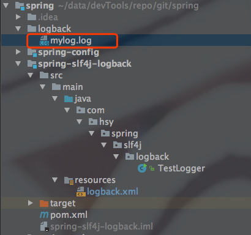

## 运行

运行TestLogger.java文件，效果如图

项目结构图

## 历史文章

[spring实战1 读取配置文件属性](http://blog.csdn.net/u012806787/article/details/78611037)

## 官方资料

[logback 官方资料](https://logback.qos.ch/manual/configuration.html)